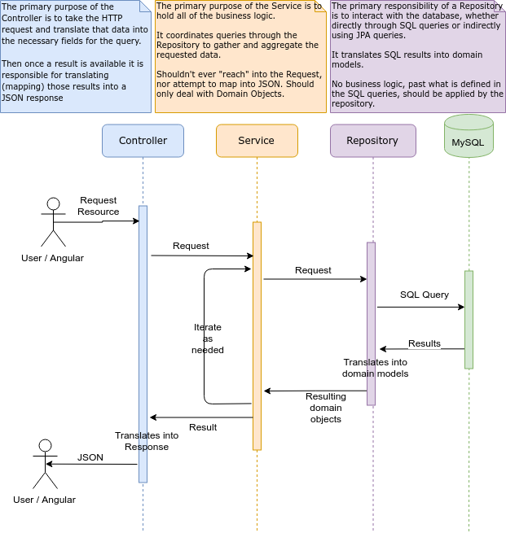

# Architecture

- [Architecture](#architecture)
  * [Project Structure](#project-structure)
  * [Separation of Concerns](#separation-of-concerns)
  * [Spring Initializr](#spring-initializr)

## Project Structure

```
+--- src/
|   +--- main/
|   |   +--- java/
|   |   |   +--- com/
|   |   |   |   +--- shmoozed/
|   |   |   |   |   +--- example/
|   |   |   |   |   |   +--- helloworld/
|   |   |   |   |   |   |   +--- HelloWorldApplication.java
|   |   +--- resources/
|   |   |   +--- application.properties 
|   +--- test/
|   |   +--- java/
|   |   |   +--- com/
|   |   |   |   +--- shmoozed/
|   |   |   |   |   +--- example/
|   |   |   |   |   |   +--- helloworld/
|   |   |   |   |   |   |   +--- HelloWorldApplicationTest.java
+--- pom.xml
```

## Separation of Concerns

A rigid structure is implemented by the backend to ensure separation of concerns at each point in the request
process. The following diagram illustrates the process of a request for data coming from a user/client. By following
these standards it helps to avoid "spaghetti code".



## Spring Initializr

The back-end app was originally generated using [Spring Initializr](https://start.spring.io/)
