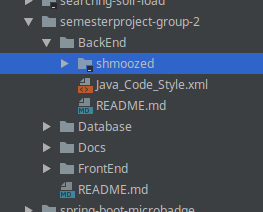
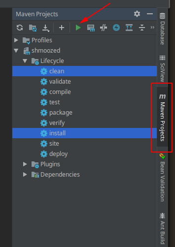
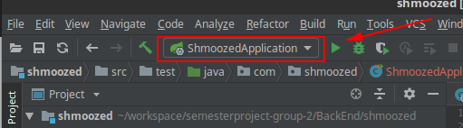
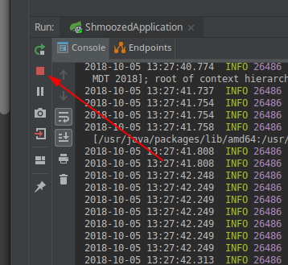
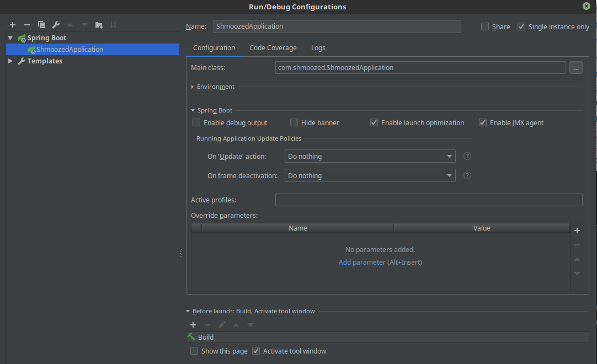

# Shmoozed Back-end API

The Shmoozed Back-end API is developed in Java.

## Technologies Used

* Java
* Maven (dependency management & building/packaging)
* Spring
* Spring Boot

## Table of Contents

<!-- Table of contents generated at https://ecotrust-canada.github.io/markdown-toc/ -->

- [Shmoozed Back-end API](#shmoozed-back-end-api)
  * [Technologies Used](#technologies-used)
  * [Table of Contents](#table-of-contents)
- [Development Setup](#development-setup)
  * [Prerequisites](#prerequisites)
  * [Maven Installation](#maven-installation)
  * [Docker MySQL](#docker-mysql)
    + [Useful Docker Commands](#useful-docker-commands)
  * [IntelliJ IDE Configuration](#intellij-ide-configuration)
    + [Import Styleguide](#import-styleguide)
    + [Open/Import Project](#open-import-project)
    + [Run Application](#run-application)
    + [Run Unit Tests](#run-unit-tests)
    + [Manual Testing with Postman](#manual-testing-with-postman)
- [Architecture](#architecture)
  * [Project Structure](#project-structure)
  * [Separation of Concerns](#separation-of-concerns)
  * [Spring Initializr](#spring-initializr)
- [Deploy Procedure](#deploy-procedure)
  * [Version, Build, Tag](#version--build--tag)
  * [Build Docker Image](#build-docker-image)
    + [Docker Base Image Selection](#docker-base-image-selection)
  * [Deploy](#deploy)
    + [Rollback](#rollback)
    + [Initial Elastic Beanstalk Application Deploy](#initial-elastic-beanstalk-application-deploy)
  * [Create GitHub Release](#create-github-release)

# Development Setup

## Prerequisites

* Java 8 JDK Installed
* Docker Installed & Configured
  * (optional, but recommended for running local MySQL Database)

No instructions are provided for installing and configuring any of the above listed prerequisites.

## Maven Installation

Note that IntelliJ generally installs with its own bundled version of Maven. In most cases this is good enough to use and no additional
installation is required. However, occasionally this does cause issues. Our suggestion is to install IntelliJ, follow the configuration
steps below to import the project and see if it builds properly. If it does, skip these instructions.

A primer on Maven is provided at https://maven.apache.org/guides/getting-started/maven-in-five-minutes.html. It goes _deep_ very quickly though.
Thankfully, for the most part it will likely be "set it and forget it".

Detailed installation instructions for maven can be found at the following links:
* (Windows - very detailed) https://www.mkyong.com/maven/how-to-install-maven-in-windows/ 
* (Windows, Mac, Linux) https://www.baeldung.com/install-maven-on-windows-linux-mac

The high level description of installing Maven is:
1. Download the latest version of Maven from http://maven.apache.org/download.cgi (at the time of wrigint that is 3.5.4)
   * Windows: Download the "Binary zip archive" verion (`apache-maven-3.5.4-bin.zip`)
   * Mac / Linux: Download the "Binary tar.gz archive" verion (`apache-maven-3.5.4-bin.tar.gz`)
2. Extract to a directory
3. Set up Maven directories into your system's Path

## Docker MySQL

For local development, a MySQL Database is necessary. The recommended way to run this is to run it via a Docker Container.
These instructions use the [official MySQL](https://hub.docker.com/_/mysql/) image from Docker Hub.

Running MySQL in a Docker Container has several benefits, but the one benefit which is the deciding factor for including
this as the standard is not needing to install and configure MySQL. Simply pulling down a Docker Image that is ready to
go is simpler. (Docker is rapidly becoming an industry standard so gaining experience with it has added benefit beyond
this project itself.)

(Note - A native installation is sufficient if you choose to take that route instead. Follow instructions to apply 
schema & sql scripts from the [Database README.md](/Database/README.md))

1. Pull down the latest Docker MySQL Server:
```sh
>> docker pull mysql:5.7
```
2. Create and start a MySQL container:
```sh
>> docker run --name mysql_shmoozed -e MYSQL_ROOT_PASSWORD=my-Secret-pw -p 3306:3306 -d mysql:5.7
```
3. Verify container is running and ready:
```sh
>> docker ps

CONTAINER ID  IMAGE      COMMAND                 CREATED        STATUS       PORTS                    NAMES
0cb56dbb7217  mysql:5.7  "docker-entrypoint.s…"  3 seconds ago  Up 2 seconds -p 5801:5801, 33060/tcp  mysql_shmoozed
```
4. MySQL is now running and ready to be connected to
5. Follow instructions to apply schema & sql scripts from the [Database README.md](/Database/README.md) file.

### Useful Docker Commands

* Stop Docker Container: `docker stop mysql_shmoozed`
* Start Docker Container: `docker start mysql_shmoozed`
* Delete Docker Container (must be stopped first): `docker rm mysql_shmoozed`

## IntelliJ IDE Configuration

The following intructions are specific to IntelliJ Ultimate. Any IDE which can import a Maven pom.xml file and generate a project from it 
_should_ be able to import this project and begin working with it. 

IntelliJ Ultimate is necessary as we are using Spring & Spring Boot. See the [comparison chart](https://www.jetbrains.com/idea/features/editions_comparison_matrix.html) between Community Edition & Ultimate Edition for details. IntelliJ offers free Ultimate subscirptions to students.

One common IDE for Spring Development is [Spring Tool Suite](https://spring.io/tools) which is built on Eclipse. If no Ultimate license is 
available, consider using Spring Tool Suite which is free. No detailed instructions are provided, but it is basically just Open --> Existing Maven Project --> Locate `pom.xml` and import project.

### Import Styleguide

To help keep the code clean and unified, a code styleguide for IntelliJ is provided. These instructions explain how to import and use that in IntelliJ.

1. File --> Settings...
2. Editor --> Code Style
3. Click the "gear" icon next to `Scheme` --> Import Scheme --> IntelliJ IDEA code style XML
4. Browse to `/BackEnd/Java_Code_Style.xml`. Click Ok.
5. Check the `Current scheme` checkbox. Click Ok.
6. Ensure that `Java Code Style` is shown in the `Scheme` dropdown


### Open/Import Project

1. File --> Open...
2. Navigate to `/semesterproject-group-2/BackEnd/shmoozed` and click on the `shmoozed` directory

3. Click Ok
4. IntelliJ and Maven should download all required dependencies. Wait for this to complete.
5. In the Right Side of IntelliJ, expand the `Maven Projects` tab
6. Expand shmoozed --> Lifecycle
7. Ctrl + Click to select both `clean` and `install`
8. Click the green "Run Maven Build" button at the top of the panel.
   * (Behind the scenes this is doing a `mvn clean install` commandline operation)

9. A teminal window will appear with a bunch of log output
10. Ensure that it ends with a message of `BUILD SUCCESS` with output logs similar to:
    ```
    ....
    2018-10-05 13:15:42.377  INFO 25683 --- [           main] com.shmoozed.ShmoozedApplicationTests    : Started ShmoozedApplicationTests in 2.977 seconds (JVM running for 3.968)
    [INFO] Tests run: 1, Failures: 0, Errors: 0, Skipped: 0, Time elapsed: 3.934 s - in com.shmoozed.ShmoozedApplicationTests
    2018-10-05 13:15:42.635  INFO 25683 --- [       Thread-4] o.s.w.c.s.GenericWebApplicationContext   : Closing org.springframework.web.context.support.GenericWebApplicationContext@73e9cf30: startup date [Fri Oct 05 13:15:39 MDT 2018]; root of context hierarchy
    [INFO] 
    [INFO] Results:
    [INFO] Tests run: 1, Failures: 0, Errors: 0, Skipped: 0
    [INFO] 
    [INFO] --- maven-jar-plugin:3.0.2:jar (default-jar) @ shmoozed ---
    [INFO] Building jar: /mnt/Second/workspace/semesterproject-group-2/BackEnd/shmoozed/target/shmoozed-0.0.1-SNAPSHOT.jar
    [INFO] 
    [INFO] --- spring-boot-maven-plugin:2.0.5.RELEASE:repackage (default) @ shmoozed ---
    [INFO] 
    [INFO] --- maven-install-plugin:2.5.2:install (default-install) @ shmoozed ---
    [INFO] Installing /mnt/Second/workspace/semesterproject-group-2/BackEnd/shmoozed/target/shmoozed-0.0.1-SNAPSHOT.jar to /home/zeustopher/.m2/repository/com/shmoozed/shmoozed/0.0.1-SNAPSHOT/shmoozed-0.0.1-SNAPSHOT.jar
    [INFO] Installing /mnt/Second/workspace/semesterproject-group-2/BackEnd/shmoozed/pom.xml to /home/zeustopher/.m2/repository/com/shmoozed/shmoozed/0.0.1-SNAPSHOT/shmoozed-0.0.1-SNAPSHOT.pom
    [INFO] ------------------------------------------------------------------------
    [INFO] BUILD SUCCESS
    [INFO] ------------------------------------------------------------------------
    [INFO] Total time: 9.739 s
    [INFO] Finished at: 2018-10-05T13:15:44-06:00
    [INFO] Final Memory: 36M/323M
    [INFO] ------------------------------------------------------------------------

    Process finished with exit code 0
    ```
11. At this point, the project is configured and imported and you are ready to start using and developing the application.

### Run Application

IntelliJ should detect what it needs to in order to Run the application. To run, simply click the green "Run" button next to `ShmoozedApplication`:


(Note that behind the scenes, IntelliJ is essentially doing a `mvn spring-boot:run` on the commandline.)

You should see log output similar to:
```
  .   ____          _            __ _ _
 /\\ / ___'_ __ _ _(_)_ __  __ _ \ \ \ \
( ( )\___ | '_ | '_| | '_ \/ _` | \ \ \ \
 \\/  ___)| |_)| | | | | || (_| |  ) ) ) )
  '  |____| .__|_| |_|_| |_\__, | / / / /
 =========|_|==============|___/=/_/_/_/
 :: Spring Boot ::        (v2.0.5.RELEASE)

2018-10-05 13:27:40.738  INFO 26486 --- [           main] com.shmoozed.ShmoozedApplication         : Starting ShmoozedApplication on zeustopher-ThinkPad-W541 with PID 26486 (/mnt/Second/workspace/semesterproject-group-2/BackEnd/shmoozed/target/classes started by zeustopher in /mnt/Second/workspace/semesterproject-group-2/BackEnd/shmoozed)
2018-10-05 13:27:40.740  INFO 26486 --- [           main] com.shmoozed.ShmoozedApplication         : No active profile set, falling back to default profiles: default
2018-10-05 13:27:40.774  INFO 26486 --- [           main] ConfigServletWebServerApplicationContext : Refreshing org.springframework.boot.web.servlet.context.AnnotationConfigServletWebServerApplicationContext@13c10b87: startup date [Fri Oct 05 13:27:40 MDT 2018]; root of context hierarchy
.
.
.
2018-10-05 13:27:42.813  INFO 26486 --- [           main] o.s.b.w.embedded.tomcat.TomcatWebServer  : Tomcat started on port(s): 8080 (http) with context path ''
2018-10-05 13:27:42.816  INFO 26486 --- [           main] com.shmoozed.ShmoozedApplication         : Started ShmoozedApplication in 2.315 seconds (JVM running for 2.785)
2018-10-05 13:27:43.111  INFO 26486 --- [on(2)-127.0.0.1] o.a.c.c.C.[Tomcat].[localhost].[/]       : Initializing Spring FrameworkServlet 'dispatcherServlet'
2018-10-05 13:27:43.111  INFO 26486 --- [on(2)-127.0.0.1] o.s.web.servlet.DispatcherServlet        : FrameworkServlet 'dispatcherServlet': initialization started
2018-10-05 13:27:43.172  INFO 26486 --- [on(2)-127.0.0.1] o.s.web.servlet.DispatcherServlet        : FrameworkServlet 'dispatcherServlet': initialization completed in 61 m
```

Once you see the lines `Tomcat started on port(s): 8080 (http)` and `tarted ShmoozedApplication in 2.315 seconds` your application is running and ready to receive requests.

To stop the application, click the "Stop" button in the console window at the bottom of IntelliJ:



If for some reason IntelliJ didn't configure it properly, click the dropdown next to the "Run" button and click Edit Configurations. From there
configure an application which looks like the following screenshot:

You should only have to configure that once then IntelliJ will remember it. Select your new configuration from the dropdown and click the green
"Run" button.

Additional details about running Spring Boot applications found here: https://docs.spring.io/spring-boot/docs/current/reference/html/using-boot-running-your-application.html

### Run Unit Tests

Unit tests are run as part of the `install` phase of the normal Maven Clean and Install cycle. However, it is wise to run them fairly often.
The simplest way to do this is to Right-click on a Test file and choose "Run Test...". This will run all tests in that single file. The same thing
can be done by Right-clicking on the entire `test` directory and choose "Run Unittests in driectory". This will run all tests in that directory.

### Manual Testing with Postman

A Collection of [Postman](https://www.getpostman.com/) calls is located at `/BackEnd/postman/` which can be imported 
into Postman to jumpstart your manual testing of the Back-end API.

As new endpoints are added, these Postman collections should be updated with example calls.


# Architecture

## Project Structure

```
+--- src/
|   +--- main/
|   |   +--- java/
|   |   |   +--- com/
|   |   |   |   +--- shmoozed/
|   |   |   |   |   +--- example/
|   |   |   |   |   |   +--- helloworld/
|   |   |   |   |   |   |   +--- HelloWorldApplication.java
|   |   +--- resources/
|   |   |   +--- application.properties 
|   +--- test/
|   |   +--- java/
|   |   |   +--- com/
|   |   |   |   +--- shmoozed/
|   |   |   |   |   +--- example/
|   |   |   |   |   |   +--- helloworld/
|   |   |   |   |   |   |   +--- HelloWorldApplicationTest.java
+--- pom.xml
```

## Separation of Concerns

A rigid structure is implemented by the backend to ensure separation of concerns at each point in the request
process. The following diagram illustrates the process of a request for data coming from a user/client. By following
these standards it helps to avoid "spaghetti code".


## Spring Initializr

The back-end app was originally generated using [Spring Initializr](https://start.spring.io/)


# Deploy Procedure

Ideally, this would be automated through a DevOps / Delivery Tool such as Jenkins, etc. but due to
time constraints these manual build and deploy instructions should be followed when a new version
of the API is ready to be released into Production.

## Version, Build, Tag
1. Ensure that all tests are passing
   * Run all Unit/Component Tests
   * Launch application and run all Acceptance Tests
2. Increment the `version` in the pom.xml
   * A [Semantic Versioning](https://semver.org/) scheme of `MAJOR.MINOR.PATCH` should be used
3. Perform a `maven clean install`. Ensure that the build resulted in a `BUILD SUCCESS`.
4. Commit & Push the version number change to Github. Do a Pull Request. Receive PR Approval and Merge PR.
5. Tag the Merge Commit in GitHub.

## Build Docker Image
1. Ensure that the [Build, Version, & Tag](#version-build-tag) have been completed
2. Perform a `docker build -t shmoozed/shmoozed-api:latest -t shmoozed/shmoozed-api:X.Y.Z .` from within the `/shmoozed/BackEnd/` directory.
   * Substitute the current `version` from the pom.xml in as the `X.Y.Z` tag version.
3. Ensure that the docker build resulted in a `Successfully built`.
   ```
   Sending build context to Docker daemon  43.58MB
   Step 1/4 : FROM java:8-jdk-alpine
    ---> 3fd9dd82815c
   Step 2/4 : VOLUME /tmp
    ---> Using cache 
    ---> 1a6a0e74fd18
   Step 3/4 : COPY target/*.jar app.jar
    ---> Using cache
    ---> 59f4b8cd483a
   Step 4/4 : ENTRYPOINT ["java","-jar","/app.jar"]
    ---> Using cache
    ---> 93e73e16e65d
   Successfully built 93e73e16e65d
   Successfully tagged shmoozed/shmoozed-api:latest
   ```
4. Verify the image was built and tagged properly using `docker images`
   ```
   REPOSITORY              TAG                 IMAGE ID            CREATED             SIZE
   shmoozed/shmoozed-api   0.2.8               df4e936490a6        2 seconds ago       126MB
   shmoozed/shmoozed-api   latest              df4e936490a6        2 seconds ago       126MB
   openjdk                 8-jre-alpine        7e72a7dcf7dc        3 days ago          83.1MB

   ```
5. Test the built image by performing `docker run --name shmoozed -p 5000:5000 -p 9000:9000 shmoozed/shmoozed-api`

### Docker Base Image Selection

We want to keep the Docker image which is created as small as possible so that it is faster to deploy. There are various java
base images which are available to run the application.

After pulling and building on all alpine-based image bases, we will be using the `openjdk:8-jre-alpine` image as it is the 
smallest size available at the time of writing for Java 8.

```
$ docker images
REPOSITORY          TAG                 IMAGE ID            CREATED             SIZE
openjdk             8-jre-alpine        7e72a7dcf7dc        3 days ago          83.1MB
openjdk             8-jdk-alpine        2cfb1dc1f0c8        3 days ago          103MB
java                8-jre-alpine        fdc893b19a14        22 months ago       108MB
java                8-jdk-alpine        3fd9dd82815c        22 months ago       145MB
```

## Deploy

1. Follow all [Build, Version, & Tag](#version-build-tag) instructions
2. Log into AWS Account
3. Navigate to Elastic Beanstalk and find the `shmoozed-backend-api > Environments > ShmoozedBackendApi-env`
4. Click the `Upload and Deploy` button
5. Browse to `/BackEnd/shmoozed/target/shmoozed-X.Y.Z.jar` that was built previously using the `maven clean install` command
6. Click the `Deploy` button
7. Wait for the new JAR to be uploaded
8. AWS Elastic Beanstalk should display a message `Elastic Beanstalk is updating your environment`. Wait for it to complete the update.
9. Once the message disappears and the Health indicator goes Green and says `Ok` the application has been deployed and is ready to receive traffic
10. Perform several "sanity checks" against the application by exercising the API with Postman.

### Rollback

1. If something is wrong and the application needs to be rolled back, navigate to `shmoozed-backend-api > Application versions`.
2. Check the box of a previous JAR
3. Click the `Deploy` button
4. Verify the application is being deployed to the proper place. Click the `Deploy` button.
5. A message `Info - The deployment to ShmoozedBackendApi-env started successfully` messages should appear.
6. Navigate to the dashboard and ensure that the environment has gone Green and says `Ok`

### Initial Elastic Beanstalk Application Deploy
Based on instructions found at:
* https://medium.com/@ryanzhou7/running-spring-boot-on-amazon-web-services-for-free-f3b0aeec809
* A few additional pointers from https://medium.com/@autumn.bom/deploying-spring-boot-jar-application-on-beanstalk-java-se-platform-45d8d04608ae
* A few additional pointers from https://aws.amazon.com/blogs/devops/deploying-a-spring-boot-application-on-aws-using-aws-elastic-beanstalk/ 

## Create GitHub Release
Document release and add binaries in Github...
