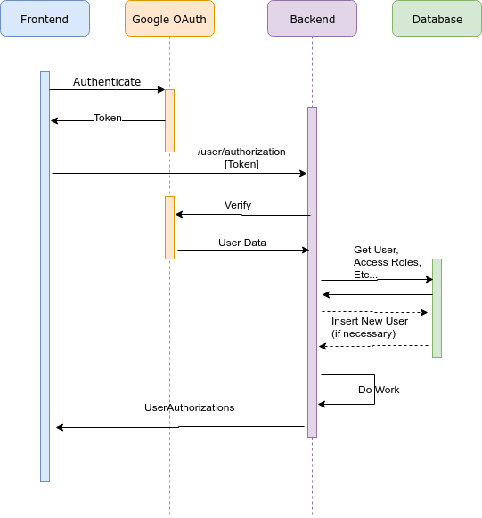

# Authentication

## Google Authentication

We are using Google Authentication as our primary authentication source. Specifically this project
uses the OAuth2 protocol.

* https://developers.google.com/identity/protocols/OAuth2 

## Sequence



## Contract

After authenticating through Google, the frontend will call the backend on the `/user/authorization`
endpoint. The frontend will pass the token which was generated by Google. The backend with verify that token. It will then select the user information from the database. If a user doesn't yet exist, a new
user will be automatically created.

The Backend will respond with a `UserAuthorizations` object:

```json
{
  "id":12345,
  "roles":["BUYER", "SELLER", ...]
}

```

## Response Codes

* `401` = Invalid / expired / bad / missing token
* `403` = Insufficient permissions to acess the requested resource
